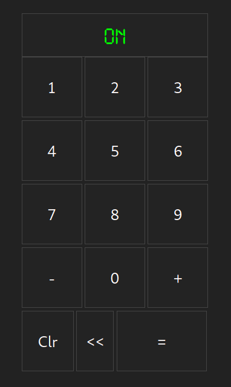

# calculatrice Html et Javascript

 

 
voici un moyen parmis des miellie pour coder un calculatrice sur un navigateur !

### About Langage Programing

## License
Free OpenSource 

## Folow Me @assamer

